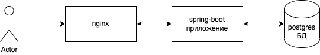

# Free-project
Free-project - это проект "заготовка" для будущих проектов

# Состав проекта

* БД - postgres
* Сервер - nginx
* Приложение - spring-boot



## Зависимости
1. Установить [docker](https://docs.docker.com/engine/install/)
1. Установить postman для выполнения запросов(по необходимости)

# Настройка postgres
Необходимо развернуть container postgres в docker:

```
docker run -d --name mypostgres -e POSTGRES_DB=free_project -e POSTGRES_PASSWORD=${password} -e POSTGRES_USER=${username} -e PGDATA=/var/lib/postgresql/data/pgdata -v ${dir_local_machine}:/var/lib/postgresql/data -p 5432:5432 postgres
```

**ОБЯЗАТЕЛЬНО** заменить:

* ${password} - пароль БД
* ${username} - пользователь БД (Например: postgres)
* ${dir_local_machine} - путь до каталога, где будут лежать данные БД (Например: /home/postgres)

Необязательно: 

* POSTGRES_DB=free_project - название БД может быть любое
* --name mypostgres - название container может быть любое

Подробнее на [docker hub](https://hub.docker.com/_/postgres)

# Настройка Nginx

```
docker run --name mynginx --add-host host.docker.internal:host-gateway -v ${nginx_conf.d}:/etc/nginx/conf.d -v ${nginx_conf}:/etc/nginx/nginx.conf -p 8080:80 -p 443:443 -d nginx
```

**ОБЯЗАТЕЛЬНО** заменить:

* ${nginx_conf.d} - путь до папки с конфигурацией (Например: /home/nginx/conf.d)
* ${nginx_conf} - путь до конфигурации nginx.conf (Например: /home/nginx/nginx.conf)

Необязательно: 
* --name mynginx - название container может быть любое

Параметр `--add-host host.docker.internal:host-gateway` даст возможность ходить на ip локальной машины

Конфигурацию можно взять [тут](./docs/nginx)

Подробнее на [docker hub](https://hub.docker.com/_/nginx)

# Настройка Spring-boot приложения

## Конфигурация

В [pom.xml](./pom.xml) необходимо задать следующие параметры:

* datasource.host - хост БД, если container развернут локально можно установить localhost
* datasource.port - порт БД. По умолчанию: 5432. В команде это `-p 5432:5432`
* datasource.db - если ничего не меняли: free_project. Значение, которое было указано в `POSTGRES_DB` 
* db.schema - имя схемы. По умолчанию: public
* db.username - имя пользователя БД. Значение, которое было указано в `POSTGRES_USER`
* db.password - имя пользователя БД. Значение, которое было указано в `POSTGRES_PASSWORD`

В файле [ssl-secret.properties](./configs/src/main/resources/ssl-secret.properties) установить пароль `server.ssl.key-store-password=123456`

## Запуск

Для запуска spring-boot приложения: `ru.free.project.FreeProjectApplication` класс в модуле `business`

## БД

### Автоматическая проливка

В текущий момент скрипты БД прольются автоматически и создадутся все необходимые таблицы. Для отключения автоматической проливки необходимо выставить значение false у настройки `spring.liquibase.enabled`

### Проливка c помощью liquibase

В модуле `repository` необходимо выполнить команду `mvn liquibase:update -f pom.xml`

### После проливки

После проливки в таблице USERS будет создан пользователь `admin` c паролем `adminPass`. Пароль можно будет заменить после запуска.

## Коллекция postman

[FreeProject](./postman)

## Сборка

Для сборки jar необходимо выполнить `mvn clean install -f pom.xml`. После этого в корне проекта появится free-project-${project.version}.jar, где ${project.version} версия приложения. 


